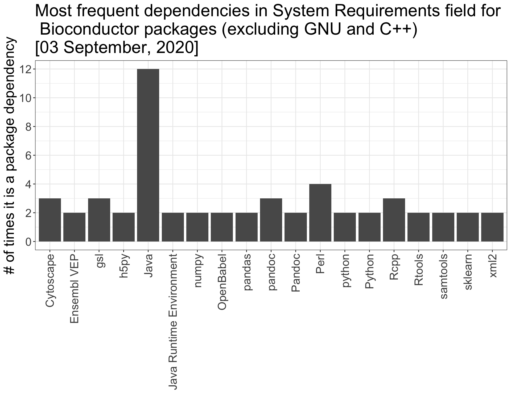

<br>

------------------------------------------------------------------------

What is Herper?
---------------

The Herper package is a simple toolset to install and manage Conda
packages and environments from within the R console.

Unfortunately many tools for data analysis are not available in R, but
are present in public repositories like conda. With Herper users can
install, manage, record and run conda tools from the comfort of their R
session.

Furthermore, many R packages require the use of these external
dependencies. Again these dependencies can be installed and managed with
the Conda package repository. For example 169 Bioconductor packages have
external dependencies listed in their System Requirements field (often
with these packages having several requirements) \[03 September, 2020\].

<br>



Herper provides an ad-hoc approach to handling external system
requirements for R packages. For people developing packages with python
conda dependencies we recommend using
[basilisk](https://bioconductor.org/packages/release/bioc/html/basilisk.html)
to internally support these system requirements pre-hoc.

The Herper package was developed by [Matt
Paul](https://github.com/matthew-paul-2006), [Doug
Barrows](https://github.com/dougbarrows) and [Thomas
Carroll](https://github.com/ThomasCarroll) at the [Rockefeller
University Bioinformatics Resources
Center](https://rockefelleruniversity.github.io) with contributions from
[Kathryn Rozen-Gagnon](https://github.com/kathrynrozengagnon).

<br>

Installation
------------

Use the `BiocManager` package to download and install the package from
our Github repository:

``` r
if (!requireNamespace("BiocManager", quietly = TRUE)) {
      install.packages("BiocManager")
  }
BiocManager::install("Herper")
```

<br> Once installed, load it into your R session:

``` r
library(Herper)
```

<br>

Simple install of Conda packages from R console using **install\_CondaTools**.
------------------------------------------------------------------------------

The **install\_CondaTools()** function allows the user to specify
required Conda software and the desired environment to install into.

Miniconda is installed as part of the process (by default into the
r-reticulate’s default Conda location -
/Users/mattpaul/Library/r-miniconda) and the user’s requested conda
environment built within the same directory (by default
/Users/mattpaul/Library/r-miniconda/envs/USERS\_ENVIRONMENT\_HERE).

If you already have Miniconda installed or you would like to install to
a custom location, you can specify the path with the *pathToMiniConda*
parameter. In this example we are installing in a temporary directory,
but most likely you will want to install/use a stable version of
Miniconda.

``` r
myMiniconda <- file.path(tempdir2(), "Test")
myMiniconda
```

    ## [1] "/var/folders/zy/x35d37h50sq2_fp3zrjydcl00000gn/T//RtmpDzkb9J/rr/Test"

``` r
install_CondaTools("salmon", "herper", pathToMiniConda = myMiniconda)
```

    ## $pathToConda
    ## [1] "/var/folders/zy/x35d37h50sq2_fp3zrjydcl00000gn/T//RtmpDzkb9J/rr/Test/bin/conda"
    ## 
    ## $environment
    ## [1] "herper"
    ## 
    ## $pathToEnvBin
    ## [1] "/var/folders/zy/x35d37h50sq2_fp3zrjydcl00000gn/T//RtmpDzkb9J/rr/Test/envs/herper/bin"

<br> We can add additional tools to our Conda environment by specifying
*updateEnv = TRUE*. A vector of tools can be used to install several at
once.

``` r
pathToConda <- install_CondaTools(c("samtools", "kallisto"), "herper", updateEnv = TRUE, pathToMiniConda = myMiniconda)

pathToConda
```

    ## $pathToConda
    ## [1] "/var/folders/zy/x35d37h50sq2_fp3zrjydcl00000gn/T//RtmpDzkb9J/rr/Test/bin/conda"
    ## 
    ## $environment
    ## [1] "herper"
    ## 
    ## $pathToEnvBin
    ## [1] "/var/folders/zy/x35d37h50sq2_fp3zrjydcl00000gn/T//RtmpDzkb9J/rr/Test/envs/herper/bin"

<br> Specific package versions can be installed using conda formatted
inputs into the *tools* argument i.e. “salmon==1.3”, “salmon\>=1.3” or
“salmon\<=1.3”. This can also be used to specifically upgrade or
downgrade existing tools in the chosen environment.

``` r
pathToConda <- install_CondaTools("salmon<=1.3", "herper", updateEnv = TRUE, pathToMiniConda = myMiniconda)
```

<br>

Install R package dependencies with **install\_CondaSysReqs**.
--------------------------------------------------------------

The **install\_CondaSysReqs** checks the System Requirements for the
specified R package, and uses Conda to install this software. Here we
will use a test package contained within Herper. This test package has
two System Requirements:

``` r
testPkg <- system.file("extdata/HerperTestPkg", package = "Herper")
install.packages(testPkg, type = "source", repos = NULL)
utils::packageDescription("HerperTestPkg", fields = "SystemRequirements")
```

    ## [1] "samtools==1.10, rmats>=v4.1.0"

The user can simply supply the name of an installed R package, and
**install\_CondaSysReqs** will install the System Requirements through
conda.

``` r
install_CondaSysReqs("HerperTestPkg", pathToMiniConda = myMiniconda)
```

    ## $pathToConda
    ## [1] "/var/folders/zy/x35d37h50sq2_fp3zrjydcl00000gn/T//RtmpDzkb9J/rr/Test/bin/conda"
    ## 
    ## $environment
    ## [1] "HerperTestPkg_0.1.0"
    ## 
    ## $pathToEnvBin
    ## [1] "/var/folders/zy/x35d37h50sq2_fp3zrjydcl00000gn/T//RtmpDzkb9J/rr/Test/envs/HerperTestPkg_0.1.0/bin"

By default these packages are installed in a new environment, which has
the name name of the R package and its version number. Users can control
the environment name using the *env* parameter. As with
**install\_CondaTools()**, user can control which version of Miniconda
with the parameter *pathToMiniConda*, and whether they want to amend an
existing environment with the parameter *updateEnv*.

*Note: **install\_CondaSysReqs** can handle standard System Requirement
formats, but will not work if the package has free form text. In this
case just use **install\_CondaTools***

<br>

Using external software with the **with\_CondaEnv** and **local\_CondaEnv** functions.
--------------------------------------------------------------------------------------

Once installed within a conda environment, many external software can be
executed directly from the conda environment’s bin directory without
having to perform any additional actions.

``` r
pathToSalmon <- file.path(pathToConda$pathToEnvBin,"salmon")
Res <- system2(command=pathToSalmon, args = "-h",stdout = TRUE)
Res
```

    ## salmon v1.3.0
    ## 
    ## Usage:  salmon -h|--help or 
    ##         salmon -v|--version or 
    ##         salmon -c|--cite or 
    ##         salmon [--no-version-check] <COMMAND> [-h | options]
    ## 
    ## Commands:
    ##      index      : create a salmon index
    ##      quant      : quantify a sample
    ##      alevin     : single cell analysis
    ##      swim       : perform super-secret operation
    ##      quantmerge : merge multiple quantifications into a single file

Some external software however require additional environmental variable
to be set in order to execute correctly. An example of this would be
**Cytoscape** which requires the java home directory and java library
paths to be set prior to its execution.

The Herper package uses the **[withr](https://withr.r-lib.org)** family
of functions (**with\_CondaEnv()** and **local\_CondaEnv()**) to provide
methods to **temporarily** alter the system PATH and to add or update
any required environmental variables. This is done without formally
activating your environment or initializing your conda.

The **with\_CondaEnv** allows users to run R code with the required PATH
and environmental variables automatically set. The **with\_CondaEnv**
function simply requires the name of conda environment and the code to
be executed within this environment. Additionally we can also the
**pathToMiniconda** argument to specify any custom miniconda install
location.

The **with\_CondaEnv** function will update the PATH we can now run the
above salmon command without specifying the full directory path to
salmon.

``` r
res <- with_CondaEnv("herper",
                      system2(command="salmon",args = "-h",stdout = TRUE),
                      pathToMiniConda=myMiniconda)
res
```

    ## salmon v1.3.0
    ## 
    ## Usage:  salmon -h|--help or 
    ##         salmon -v|--version or 
    ##         salmon -c|--cite or 
    ##         salmon [--no-version-check] <COMMAND> [-h | options]
    ## 
    ## Commands:
    ##      index      : create a salmon index
    ##      quant      : quantify a sample
    ##      alevin     : single cell analysis
    ##      swim       : perform super-secret operation
    ##      quantmerge : merge multiple quantifications into a single file

The **local\_CondaEnv** function acts in a similar fashion to the
**with\_CondaEnv** function and allows the user to temporarily update
the required PATH and environmental variable from within a function. The
PATH and environmental variables will be modified only until the current
function ends.

**local\_CondaEnv** is best used within a user-created function,
allowing access to the Conda environment’s PATH and variables from
within the the function itself but resetting all environmental variables
once complete.

``` r
salmonHelp <- function(){
  local_CondaEnv("herper",pathToMiniConda=myMiniconda)
  helpMessage <- system2(command="salmon",args = "-h",stdout = TRUE)
  helpMessage
}
salmonHelp()
```

    ## salmon v1.3.0
    ## 
    ## Usage:  salmon -h|--help or 
    ##         salmon -v|--version or 
    ##         salmon -c|--cite or 
    ##         salmon [--no-version-check] <COMMAND> [-h | options]
    ## 
    ## Commands:
    ##      index      : create a salmon index
    ##      quant      : quantify a sample
    ##      alevin     : single cell analysis
    ##      swim       : perform super-secret operation
    ##      quantmerge : merge multiple quantifications into a single file

To further demonstrate this we will use the first command from the
[seqCNA](https://www.bioconductor.org/packages/release/bioc/html/seqCNA.html)
vignette. This step requires samtools. If this is not installed and
available there is an error.

``` r
library(seqCNA)
data(seqsumm_HCC1143)
try(rco <- readSeqsumm(tumour.data = seqsumm_HCC1143), silent = FALSE)
```

Samtools is listed as a System Requirement for seqCNA, so we can first
use **install\_CondaSysReqs()** to install samtools. In this case we are
installing samtools in the environment: seqCNA\_env. We can then run the
seqCNA command using **with\_CondaEnv** specifying that we want to use
our environment containing samtools. seqCNA can then find samtools and
execute successfully.

``` r
install_CondaSysReqs(pkg="seqCNA",env="seqCNA_env",pathToMiniConda=myMiniconda)
rco <- with_CondaEnv(new="seqCNA_env",readSeqsumm(tumour.data=seqsumm_HCC1143)
 ,pathToMiniConda = myMiniconda)
summary(rco)
```

    ## Basic information:
    ##   SeqCNAInfo object with 5314 200Kbp-long windows.
    ##   PEM information is not available.
    ##   Paired normal is not available.
    ##   Genome and build unknown (chromosomes chr1 to chr5).
    ## The profile is not yet normalized and not yet segmented.

<br>

Finding Conda packages with **conda\_search**
---------------------------------------------

If the user is unsure of the exact name, or version of a tool available
on conda, they can use the **conda\_search** function.

``` r
conda_search("salmon", pathToMiniConda = myMiniconda)
```

    ##      name version                                    channel
    ## 2  salmon   0.8.2 https://conda.anaconda.org/bioconda/osx-64
    ## 3  salmon   0.9.0 https://conda.anaconda.org/bioconda/osx-64
    ## 5  salmon   0.9.1 https://conda.anaconda.org/bioconda/osx-64
    ## 6  salmon  0.10.0 https://conda.anaconda.org/bioconda/osx-64
    ## 7  salmon  0.10.1 https://conda.anaconda.org/bioconda/osx-64
    ## 9  salmon  0.10.2 https://conda.anaconda.org/bioconda/osx-64
    ## 11 salmon  0.11.3 https://conda.anaconda.org/bioconda/osx-64
    ## 12 salmon  0.12.0 https://conda.anaconda.org/bioconda/osx-64
    ## 14 salmon  0.13.0 https://conda.anaconda.org/bioconda/osx-64
    ## 15 salmon  0.13.1 https://conda.anaconda.org/bioconda/osx-64
    ## 17 salmon  0.14.0 https://conda.anaconda.org/bioconda/osx-64
    ## 20 salmon  0.14.1 https://conda.anaconda.org/bioconda/osx-64
    ## 22 salmon  0.14.2 https://conda.anaconda.org/bioconda/osx-64
    ## 23 salmon  0.15.0 https://conda.anaconda.org/bioconda/osx-64
    ## 24 salmon   1.0.0 https://conda.anaconda.org/bioconda/osx-64
    ## 25 salmon   1.1.0 https://conda.anaconda.org/bioconda/osx-64
    ## 26 salmon   1.2.0 https://conda.anaconda.org/bioconda/osx-64
    ## 27 salmon   1.2.1 https://conda.anaconda.org/bioconda/osx-64
    ## 28 salmon   1.3.0 https://conda.anaconda.org/bioconda/osx-64

    ## [1] TRUE

Specific package versions can be searched for using the conda format
i.e. “salmon==1.3”, “salmon\>=1.3” or “salmon\<=1.3”. Searches will also
find close matches for incorrect queries. Channels to search in can be
controlled with *channels* parameter.

``` r
conda_search("salmon<=1.0", pathToMiniConda = myMiniconda)
```

    ##      name version                                    channel
    ## 2  salmon   0.8.2 https://conda.anaconda.org/bioconda/osx-64
    ## 3  salmon   0.9.0 https://conda.anaconda.org/bioconda/osx-64
    ## 5  salmon   0.9.1 https://conda.anaconda.org/bioconda/osx-64
    ## 6  salmon  0.10.0 https://conda.anaconda.org/bioconda/osx-64
    ## 7  salmon  0.10.1 https://conda.anaconda.org/bioconda/osx-64
    ## 9  salmon  0.10.2 https://conda.anaconda.org/bioconda/osx-64
    ## 11 salmon  0.11.3 https://conda.anaconda.org/bioconda/osx-64
    ## 12 salmon  0.12.0 https://conda.anaconda.org/bioconda/osx-64
    ## 14 salmon  0.13.0 https://conda.anaconda.org/bioconda/osx-64
    ## 15 salmon  0.13.1 https://conda.anaconda.org/bioconda/osx-64
    ## 17 salmon  0.14.0 https://conda.anaconda.org/bioconda/osx-64
    ## 20 salmon  0.14.1 https://conda.anaconda.org/bioconda/osx-64
    ## 22 salmon  0.14.2 https://conda.anaconda.org/bioconda/osx-64
    ## 23 salmon  0.15.0 https://conda.anaconda.org/bioconda/osx-64

    ## [1] TRUE

``` r
conda_search("salm", pathToMiniConda = myMiniconda)
```

    ## [1] FALSE

<br>

Export of Conda environments to YAML files using **export\_CondaEnv**.
----------------------------------------------------------------------

The **export\_CondaEnv** function allows the user to export the
environment information to a *.yml* file. These environment YAML files
contain all essential information about the package, allowing for
reproducibility and easy distribution of Conda system configuration for
collaboration.

``` r
yml_name <- paste0("herper_", format(Sys.Date(), "%Y%m%d"), ".yml")
export_CondaEnv("herper", yml_name, pathToMiniConda = myMiniconda)
```

    ## [1] "herper_20201026.yml"

<br>

The YAML export will contain all packages in the environment by default.
If the user wants to only export the packages that were specifically
installed and not their dependencies they can use the *depends*
paramter.

``` r
yml_name <- paste0("herper_nodeps_", format(Sys.Date(), "%Y%m%d"), ".yml")
export_CondaEnv("herper", yml_name, depends = FALSE, pathToMiniConda = myMiniconda)
```

    ## [1] "herper_nodeps_20201026.yml"

<br>

Import of Conda environments from YAML files using **import\_CondaEnv**.
------------------------------------------------------------------------

The **import\_CondaEnv** function allows the user to create a new conda
environment from a *.yml* file. These can be previously exported from
**export\_CondaEnv**, conda, renv or manually created.

Users can simply provide a path to the YAML file for import. They can
also specify the environment name, but by default the name will be taken
from the YAML.

``` r
testYML <- system.file("extdata/test.yml",package="Herper")
import_CondaEnv(yml_import=testYML, pathToMiniConda = myMiniconda)
```

<br>

Checking for existing environments with **list\_CondaEnv**
----------------------------------------------------------

The **list\_CondaEnv** function allows users to check what environments
already exist within the given conda build.

If the User is using multiple builds of conda and wants to check
environments across all them, they can include the parameter *allCondas
= TRUE*.

``` r
list_CondaEnv(pathToMiniConda = myMiniconda)
```

    ##                                                                    conda path                 env
    ## 1 /private/var/folders/zy/x35d37h50sq2_fp3zrjydcl00000gn/T/RtmpDzkb9J/rr/Test                Test
    ## 2 /private/var/folders/zy/x35d37h50sq2_fp3zrjydcl00000gn/T/RtmpDzkb9J/rr/Test HerperTestPkg_0.1.0
    ## 3 /private/var/folders/zy/x35d37h50sq2_fp3zrjydcl00000gn/T/RtmpDzkb9J/rr/Test              herper
    ## 4 /private/var/folders/zy/x35d37h50sq2_fp3zrjydcl00000gn/T/RtmpDzkb9J/rr/Test             my_test
    ## 5 /private/var/folders/zy/x35d37h50sq2_fp3zrjydcl00000gn/T/RtmpDzkb9J/rr/Test        r-reticulate
    ## 6 /private/var/folders/zy/x35d37h50sq2_fp3zrjydcl00000gn/T/RtmpDzkb9J/rr/Test          seqCNA_env

<br>

Checking for packages in an environment with **list\_CondaPkgs**
----------------------------------------------------------------

The **list\_CondaPkgs** function allows users to check what packages are
installed in a given environment.

``` r
list_CondaPkgs("my_test", pathToMiniConda = myMiniconda)
```

    ##                  name   version     channel platform
    ## 1            brotlipy     0.7.0 conda-forge   osx-64
    ## 2     ca-certificates 2020.6.20 conda-forge   osx-64
    ## 3             certifi 2020.6.20 conda-forge   osx-64
    ## 4                cffi    1.14.3 conda-forge   osx-64
    ## 5             chardet     3.0.4 conda-forge   osx-64
    ## 6               click     7.1.2 conda-forge   noarch
    ## 7         coloredlogs      14.0 conda-forge   osx-64
    ## 8           colormath     3.0.0 conda-forge   noarch
    ## 9        cryptography     3.1.1 conda-forge   osx-64
    ## 10             cycler    0.10.0 conda-forge   noarch
    ## 11          decorator     4.4.2 conda-forge   noarch
    ## 12           freetype    2.10.4 conda-forge   osx-64
    ## 13             future    0.18.2 conda-forge   osx-64
    ## 14      humanfriendly       8.2 conda-forge   osx-64
    ## 15               idna      2.10 conda-forge   noarch
    ## 16 importlib-metadata     2.0.0 conda-forge   noarch
    ## 17             jinja2    2.11.2 conda-forge   noarch
    ## 18               jpeg        9d conda-forge   osx-64
    ## 19         kiwisolver     1.2.0 conda-forge   osx-64
    ## 20              lcms2      2.11 conda-forge   osx-64
    ## 21            libblas     3.9.0 conda-forge   osx-64
    ## 22           libcblas     3.9.0 conda-forge   osx-64
    ## 23             libcxx    11.0.0 conda-forge   osx-64
    ## 24             libffi     3.2.1    bioconda   osx-64
    ## 25        libgfortran     5.0.0 conda-forge   osx-64
    ## 26       libgfortran5     9.3.0 conda-forge   osx-64
    ## 27          liblapack     3.9.0 conda-forge   osx-64
    ## 28        libopenblas    0.3.12 conda-forge   osx-64
    ## 29             libpng    1.6.37 conda-forge   osx-64
    ## 30            libtiff     4.1.0 conda-forge   osx-64
    ## 31       libwebp-base     1.1.0 conda-forge   osx-64
    ## 32        llvm-openmp    11.0.0 conda-forge   osx-64
    ## 33              lz4-c     1.9.2 conda-forge   osx-64
    ## 34           lzstring     1.0.4 conda-forge   noarch
    ## 35           markdown     3.3.3 conda-forge   noarch
    ## 36         markupsafe     1.1.1 conda-forge   osx-64
    ## 37    matplotlib-base     3.3.2 conda-forge   osx-64
    ## 38            multiqc       1.9    bioconda   noarch
    ## 39            ncurses       6.2 conda-forge   osx-64
    ## 40           networkx       2.5 conda-forge   noarch
    ## 41              numpy    1.19.2 conda-forge   osx-64
    ## 42            olefile      0.46 conda-forge   noarch
    ## 43            openssl    1.1.1h conda-forge   osx-64
    ## 44             pillow     8.0.1 conda-forge   osx-64
    ## 45                pip    20.2.4 conda-forge   noarch
    ## 46          pycparser      2.20 conda-forge   noarch
    ## 47          pyopenssl    19.1.0 conda-forge   noarch
    ## 48          pyparsing     2.4.7 conda-forge   noarch
    ## 49            pysocks     1.7.1 conda-forge   osx-64
    ## 50             python    3.6.11 conda-forge   osx-64
    ## 51    python-dateutil     2.8.1 conda-forge   noarch
    ## 52         python_abi       3.6 conda-forge   osx-64
    ## 53             pyyaml     5.3.1 conda-forge   osx-64
    ## 54           readline       8.0 conda-forge   osx-64
    ## 55           requests    2.24.0 conda-forge   noarch
    ## 56         setuptools    49.6.0 conda-forge   osx-64
    ## 57         simplejson     3.8.1    bioconda   osx-64
    ## 58                six    1.15.0 conda-forge   noarch
    ## 59            spectra    0.0.11 conda-forge   noarch
    ## 60             sqlite    3.33.0 conda-forge   osx-64
    ## 61                 tk    8.6.10 conda-forge   osx-64
    ## 62            tornado     6.0.4 conda-forge   osx-64
    ## 63            urllib3   1.25.11 conda-forge   noarch
    ## 64              wheel    0.35.1 conda-forge   noarch
    ## 65                 xz     5.2.5 conda-forge   osx-64
    ## 66               yaml     0.2.5 conda-forge   osx-64
    ## 67               zipp     3.4.0 conda-forge   noarch
    ## 68               zlib    1.2.11 conda-forge   osx-64
    ## 69               zstd     1.4.5 conda-forge   osx-64

<br> <br>

Acknowledgements
----------------

Thank you to Ji-Dung Luo and Wei Wang for testing/vignette
review/critical feedback and Ziwei Liang for their support.

<br>

Session Information
-------------------

``` r
sessionInfo()
```

    ## R version 4.0.2 (2020-06-22)
    ## Platform: x86_64-apple-darwin17.0 (64-bit)
    ## Running under: macOS Catalina 10.15.7
    ## 
    ## Matrix products: default
    ## BLAS:   /System/Library/Frameworks/Accelerate.framework/Versions/A/Frameworks/vecLib.framework/Versions/A/libBLAS.dylib
    ## LAPACK: /Library/Frameworks/R.framework/Versions/4.0/Resources/lib/libRlapack.dylib
    ## 
    ## locale:
    ## [1] en_US.UTF-8/en_US.UTF-8/en_US.UTF-8/C/en_US.UTF-8/en_US.UTF-8
    ## 
    ## attached base packages:
    ## [1] stats     graphics  grDevices utils     datasets  methods   base     
    ## 
    ## other attached packages:
    ##  [1] seqCNA_1.34.0       seqCNA.annot_1.24.0 adehabitatLT_0.3.25 CircStats_0.2-6    
    ##  [5] boot_1.3-25         MASS_7.3-53         adehabitatMA_0.3.14 ade4_1.7-15        
    ##  [9] sp_1.4-2            doSNOW_1.0.18       snow_0.4-3          iterators_1.0.12   
    ## [13] foreach_1.5.0       GLAD_2.52.0         Herper_0.99.2       reticulate_1.16    
    ## 
    ## loaded via a namespace (and not attached):
    ##  [1] Rcpp_1.0.5       knitr_1.29       magrittr_1.5     lattice_0.20-41  rjson_0.2.20    
    ##  [6] rlang_0.4.7      stringr_1.4.0    tools_4.0.2      parallel_4.0.2   grid_4.0.2      
    ## [11] xfun_0.17        withr_2.3.0      htmltools_0.5.0  yaml_2.2.1       digest_0.6.25   
    ## [16] Matrix_1.2-18    codetools_0.2-16 evaluate_0.14    rmarkdown_2.3    stringi_1.5.3   
    ## [21] compiler_4.0.2   jsonlite_1.7.1
